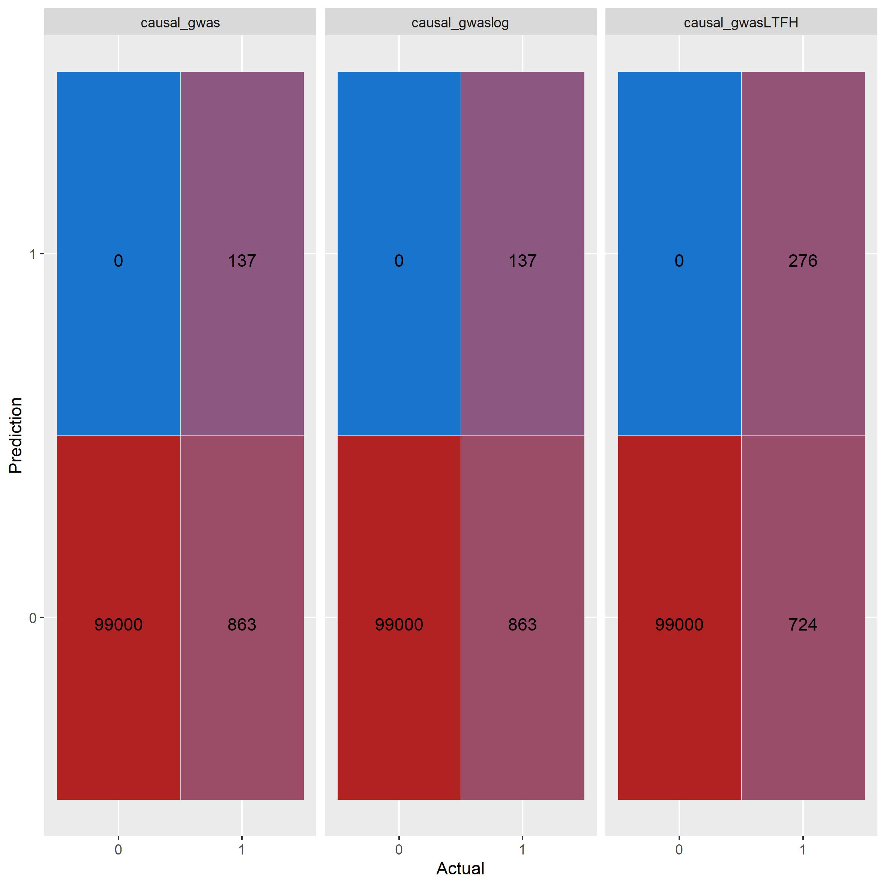
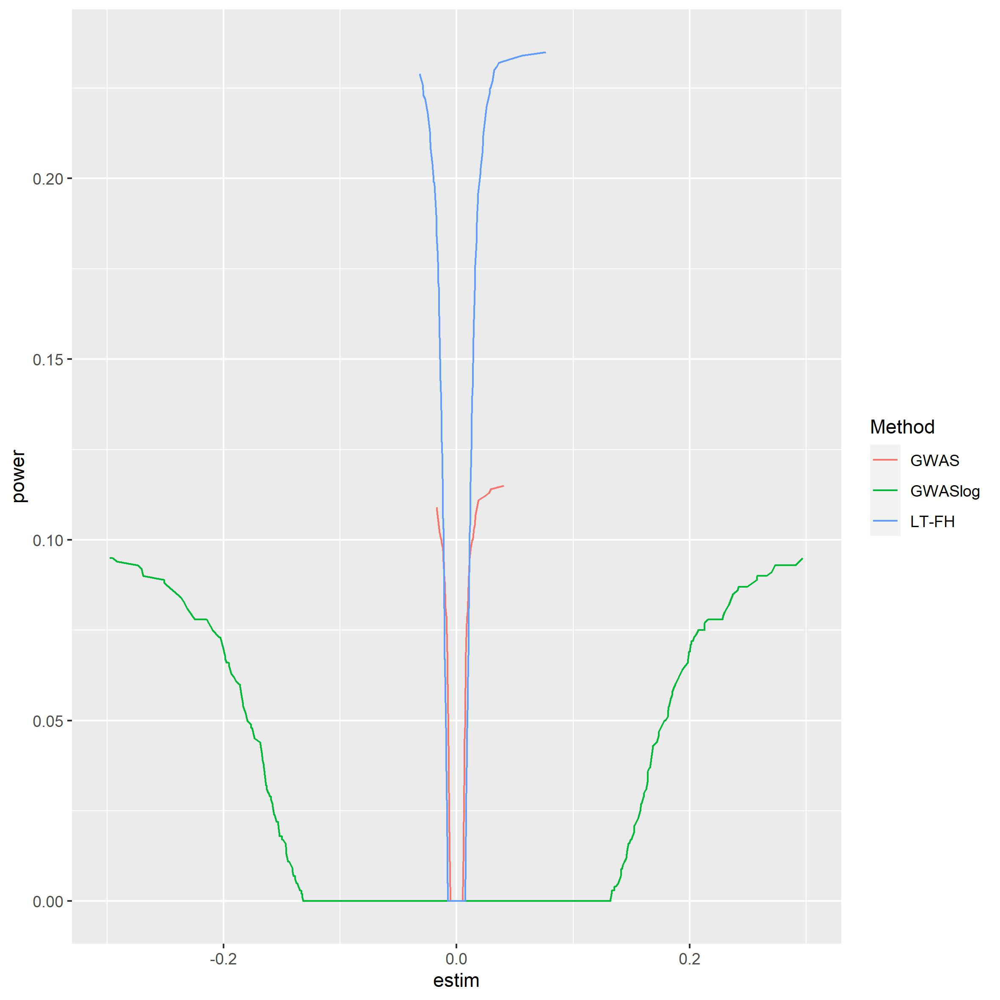
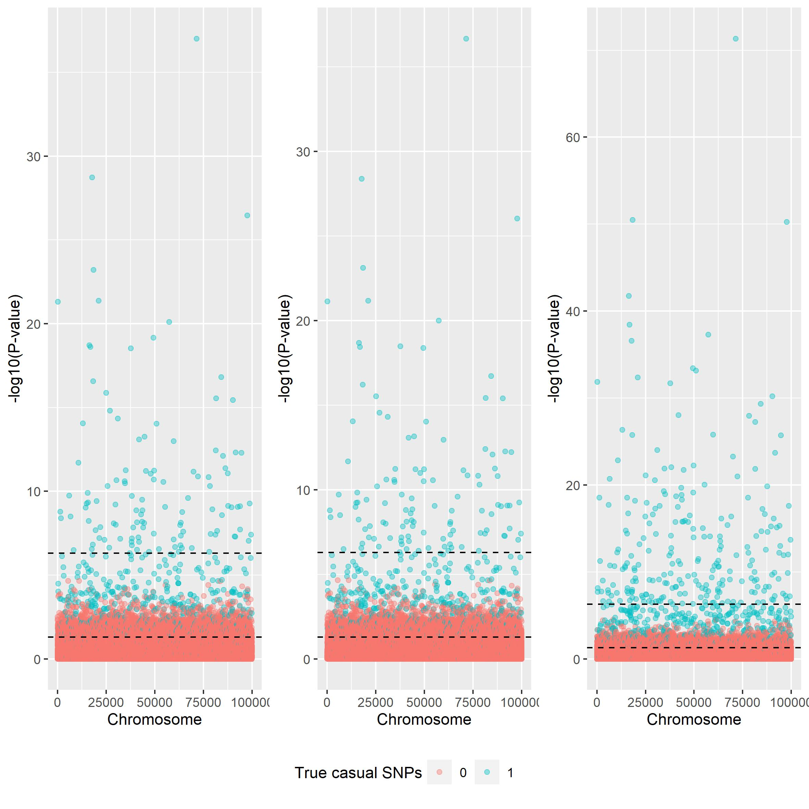
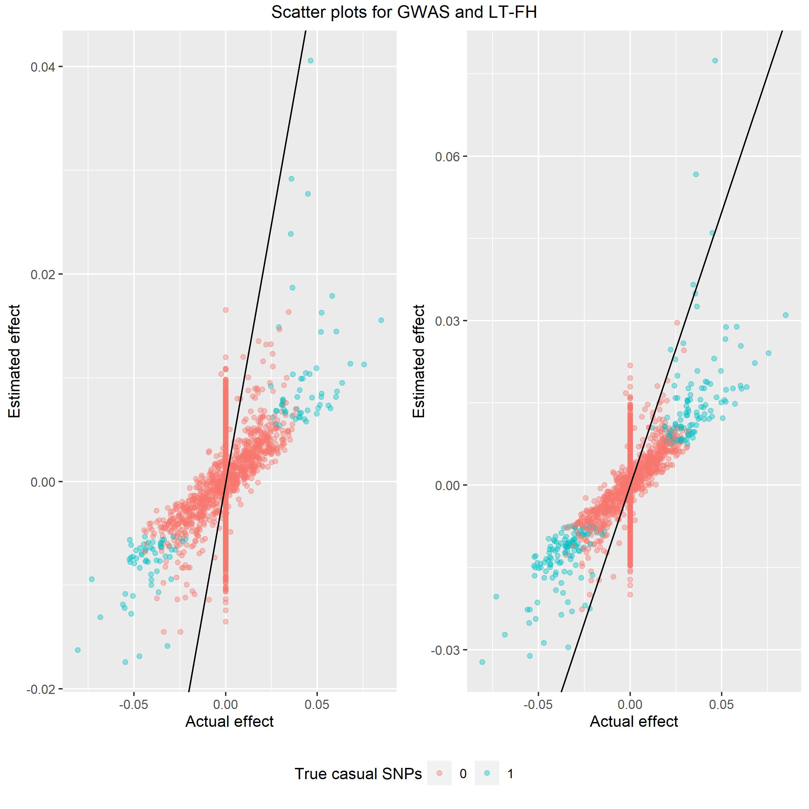

```{r, include = FALSE}
knitr::opts_chunk$set(
  collapse = TRUE,
  comment = "#>"
)
```

```{r message=FALSE, warning=FALSE}
library(genstats)
library(bigsnpr)
library(tidyverse)
```

We will in the this vignette provide visual comparison between GWAS, GWAS using logistic regression and LT-FH. We load the $10^4 \times 10^4$ data, but the following plots have been evaluated on $10^5 \times 10^5$ data. Just like `vignette('GWAS')` and `vignette('LT-FH')`.


## Confusion matrices
```{r echo=T, results='hide', fig.show='hide'}
data = snp_attach('genetic_data.rds')
data_ltfh = LTFH(data = data, n_sib = 2, K = 0.05, h2 = 0.5)
```

```{r echo=T, results='hide', fig.show='hide'}
gwas_summary <- GWAS(G = data$genotypes, y = data$fam$pheno_0, p = 5e-7)
gwaslog_summary <- GWAS(G = data$genotypes, y = data$fam$pheno_0, logreg = TRUE, p = 5e-7)
gwas_LTFH <- GWAS(G = data$genotypes, y = data_ltfh$l_g_est_0, p = 5e-7)
```

```{r echo=T, results='hide', fig.show='hide'}
true_causal = (data$map$beta != 0) - 0
causal <- tibble(causal_gwas = gwas_summary$causal_estimate, 
                 causal_gwaslog = gwaslog_summary$causal_estimate,
                 causal_gwasLTFH = gwas_LTFH$causal_estimate)

df <- causal %>% 
  pivot_longer(cols = everything(), names_to = "method") %>% 
  group_by(method) %>% 
  summarise("11" = sum(value == 1 & true_causal == 1),                                                
            "10" = sum(value == 1 & true_causal == 0),                                                
            "01" = sum(value == 0 & true_causal == 1),                                                
            "00" = sum(value == 0 & true_causal == 0)) %>% 
  pivot_longer(cols = !method) %>% group_by(method) %>% 
  mutate(
    'Prediction' = as.character(c(1,1,0,0)),
    'Actual' =  as.character(c(1, 0, 1, 0)))


df %>% 
  ggplot(aes(x = X, y = Y)) +
  geom_tile(aes(fill = value), colour = "white", show.legend = FALSE) +
  geom_text(ggplot2::aes(label = sprintf("%1.0f", value)), vjust = 1) +
  scale_fill_gradient(high = "firebrick", low = 'dodgerblue3', trans='pseudo_log') +
  facet_wrap(~method)
```

```{r}

```
GWAS using linear regression and logistic regression performs exactly the same, and LT-FH outperforms both correctly idenftifies twice the amount of causal SNPs.


## Plots

### Power plot
```{r echo=T, results='hide', fig.show='hide'}
beta = data$map$beta
gwas_df = gwas_summary %>% 
  mutate(true_causal = (beta != 0) - 0) %>%
  filter(true_causal == 1) %>%
  arrange(abs(estim)) %>%
  mutate(power = cumsum(causal_estimate)/sum(true_causal), Method='GWAS') %>%
  select(estim, power, Method)

gwaslog_df = gwaslog_summary %>% 
  mutate(true_causal = (beta != 0) - 0) %>%
  filter(true_causal == 1) %>%
  arrange(abs(estim)) %>%
  mutate(power = cumsum(causal_estimate)/sum(true_causal), Method='GWASlog') %>%
  select(estim, power, Method)

ltfh_df = gwas_LTFH %>% 
  mutate(true_causal = (beta != 0) - 0) %>%
  filter(true_causal == 1) %>%
  arrange(abs(estim)) %>%
  mutate(power = cumsum(causal_estimate)/sum(true_causal), Method='LT-FH') %>%
  select(estim, power, Method)


bind_rows(gwas_df, gwaslog_df, ltfh_df) %>%
  ggplot() + 
  geom_line(aes(x = estim, y = power, color=Method)) + 
  xlim(-0.3, 0.3)

```

```{r, echo = FALSE}

```
It is clear to see that LTFH is more powerful than both of the other GWAS methods. Logistic regression seems quite weak, but this has to be taken with a grain of salt since the estimates from logistic regression is of another form than linear regression.

### Manhattan plot

```{r echo=T, results='hide', fig.show='hide'}

plt_gwas_man = manhattan_plot(gwas_summary, beta, thresholds = c(5e-7, 0.05))
plt_log_gwas_man = manhattan_plot(gwaslog_summary, beta, thresholds = c(5e-7, 0.05))
plt_ltfh_man = manhattan_plot(gwas_LTFH, beta, thresholds = c(5e-7, 0.05))

lgnd_m = cowplot::get_legend(plt_gwas_man + theme(legend.position = "top"))

plt_gwas_man_m = plt_gwas_man + theme(legend.position="none")
plt_log_gwas_man_m = plt_log_gwas_man + theme(legend.position="none")
plt_ltfh_man_m = plt_ltfh_man + theme(legend.position="none")

gridExtra::grid.arrange(plt_gwas_man_m, 
                        plt_log_gwas_man_m, 
                        plt_ltfh_man_m,
                        lgnd_m, 
                        ncol=3,
                        nrow=2,
                        layout_matrix = rbind(c(1,2, 3), c(4,4,4)),
                        widths = c(4, 4, 4),  
                        heights = c(5, 0.5),
                        top = c("Manhattan plots for GWAS, GWAS using logistic regression, and LT-FH"))
```


```{r, echo = FALSE}

```
Again both linear and logistic regression seem very alike, and LT-FH outperforms both.

### Scatter plot
```{r echo=T, results='hide', fig.show='hide'}
plt_gwas_scat = scatter_plot(gwas_summary, beta)
plt_ltfh_scat = scatter_plot(gwas_LTFH, beta)

lgnd_s = cowplot::get_legend(plt_gwas_scat + theme(legend.position = "top"))
plt_gwas_scat_s = plt_gwas_scat + theme(legend.position="none")
plt_ltfh_scat_s = plt_ltfh_scat + theme(legend.position="none")

gridExtra::grid.arrange(plt_gwas_scat_s, 
                        plt_ltfh_scat_s,
                        lgnd_m, 
                        ncol=2,
                        nrow=2,
                        layout_matrix = rbind(c(1,2), c(3,3)),
                        widths = c(4, 4),  
                        heights = c(5, 0.5),
                        top = c("Scatter plots for GWAS and LT-FH"))
```

```{r, echo = FALSE}

```
Again we would like the spread of data to be around the y = x line, and from these plot LT-FH is closer to the line than GWAS.


