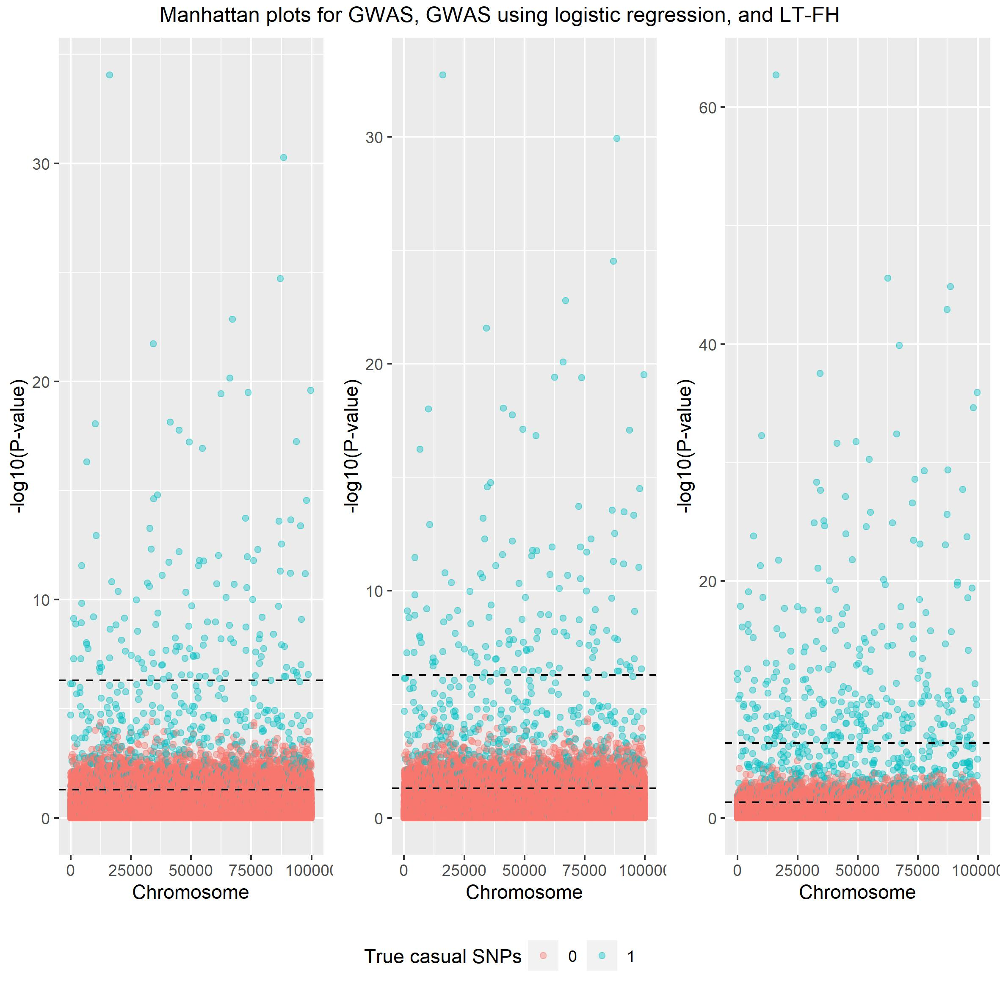

```{r, include = FALSE}
knitr::opts_chunk$set(
  collapse = TRUE,
  comment = "#>"
)
```

```{r message=FALSE, warning=FALSE}
library(genstats)
library(bigsnpr)
library(tidyverse)
```


```{r}
#data = snp_attach("example_data.rds")
data = snp_attach("genetic_data.rds")
data_ltfh = LTFH(data = data, n_sib = 2, K = 0.05, h2 = 0.5)
```

```{r}
gwas_summary <- GWAS(G = data$genotypes, y = data$fam$pheno_0, p = 5e-7, ncores = 3)
gwaslog_summary <- GWAS(G = data$genotypes, y = data$fam$pheno_0, logreg = TRUE, p = 5e-7, ncores = 3)
gwas_LTFH <- GWAS(G = data$genotypes, y = data_ltfh$l_g_est_0, p = 5e-7, ncores = 3)
```


```{r}
library(tidyverse)
true_causal = (data$map$beta != 0) - 0

estimate = tibble(estimate_gwas = gwas_summary$estim, 
                  estimate_gwasLTFH = gwas_LTFH$estim)

causal = tibble(causal_gwas = gwas_summary$causal_estimate, 
                causal_gwaslog = gwaslog_summary$causal_estimate,
                causal_gwasLTFH = gwas_LTFH$causal_estimate)

k = causal %>% 
  pivot_longer(cols = everything(), names_to = "method") %>% 
  group_by(method) %>% 
  summarise("11" = sum(value == 1 & true_causal == 1),
            "10" = sum(value == 1 & true_causal == 0),                                                
            "01" = sum(value == 0 & true_causal == 1),                                                
            "00" = sum(value == 0 & true_causal == 0)) %>% 
  pivot_longer(cols = !method) %>% 
  group_by(method) %>% 
  mutate(X = as.character(c(1,1,0,0)),
         Y =  as.character(c(1, 0, 1, 0)))


k %>% 
  ggplot(aes(x = X, y = Y)) +
  geom_tile(aes(fill = value), colour = "white", show.legend = FALSE) +
  ggplot2::geom_text(ggplot2::aes(label = sprintf("%1.0f", value)), vjust = 1) +
  ggplot2::scale_fill_gradient(high = "firebrick", low = 'dodgerblue3', trans='pseudo_log') +
  facet_wrap(~method)
```

```{r}
sapply(X = estimate, function(pred,target) mean((pred-target)^2), target = data$map$beta) %>% knitr::kable(col.names = "MSE")
```


## Plots

### Power plot
```{r echo=T, results='hide', fig.show='hide'}
gwas_df = gwas_summary %>% 
  mutate(true_causal = (beta != 0) - 0) %>%
  filter(true_causal == 1) %>%
  arrange(abs(estim)) %>%
  mutate(power = cumsum(causal_estimate)/sum(true_causal), Method='GWAS') %>%
  select(estim, power, Method)

gwaslog_df = gwaslog_summary %>% 
  mutate(true_causal = (beta != 0) - 0) %>%
  filter(true_causal == 1) %>%
  arrange(abs(estim)) %>%
  mutate(power = cumsum(causal_estimate)/sum(true_causal), Method='GWASlog') %>%
  select(estim, power, Method)

ltfh_df = ltfh_summary %>% 
  mutate(true_causal = (beta != 0) - 0) %>%
  filter(true_causal == 1) %>%
  arrange(abs(estim)) %>%
  mutate(power = cumsum(causal_estimate)/sum(true_causal), Method='LT-FH') %>%
  select(estim, power, Method)


bind_rows(gwas_df, gwaslog_df, ltfh_df) %>%
  ggplot() + 
  geom_line(aes(x = estim, y = power, color=Method)) + 
  xlim(-0.3, 0.3)

```

```{r, echo = FALSE}

```


### Manhattan plot

```{r echo=T, results='hide', fig.show='hide'}

lgnd_m = cowplot::get_legend(plt_gwas_man + theme(legend.position = "top"))

plt_gwas_man_m = plt_gwas_man + theme(legend.position="none")
plt_log_gwas_man_m = plt_log_gwas_man + theme(legend.position="none")
plt_ltfh_man_m = plt_ltfh_man + theme(legend.position="none")

gridExtra::grid.arrange(plt_gwas_man_m, 
                        plt_log_gwas_man_m, 
                        plt_ltfh_man_m,
                        lgnd_m, 
                        ncol=3,
                        nrow=2,
                        layout_matrix = rbind(c(1,2, 3), c(4,4,4)),
                        widths = c(4, 4, 4),  
                        heights = c(5, 0.5),
                        top = c("Manhattan plots for GWAS, GWAS using logistic regression, and LT-FH"))
```

```{r, echo = FALSE}

```


### Scatter plot
```{r echo=T, results='hide', fig.show='hide'}
lgnd_s = cowplot::get_legend(plt_gwas_scat + theme(legend.position = "top"))
plt_gwas_scat_s <- plt_gwas_scat + theme(legend.position="none")
plt_ltfh_scat_s <- plt_ltfh_scat + theme(legend.position="none")

gridExtra::grid.arrange(plt_gwas_scat_s, 
                        plt_ltfh_scat_s,
                        lgnd_m, 
                        ncol=2,
                        nrow=2,
                        layout_matrix = rbind(c(1,2), c(3,3)),
                        widths = c(4, 4),  
                        heights = c(5, 0.5),
                        top = c("Scatter plots for GWAS and LT-FH"))
```

```{r, echo = FALSE}

```


