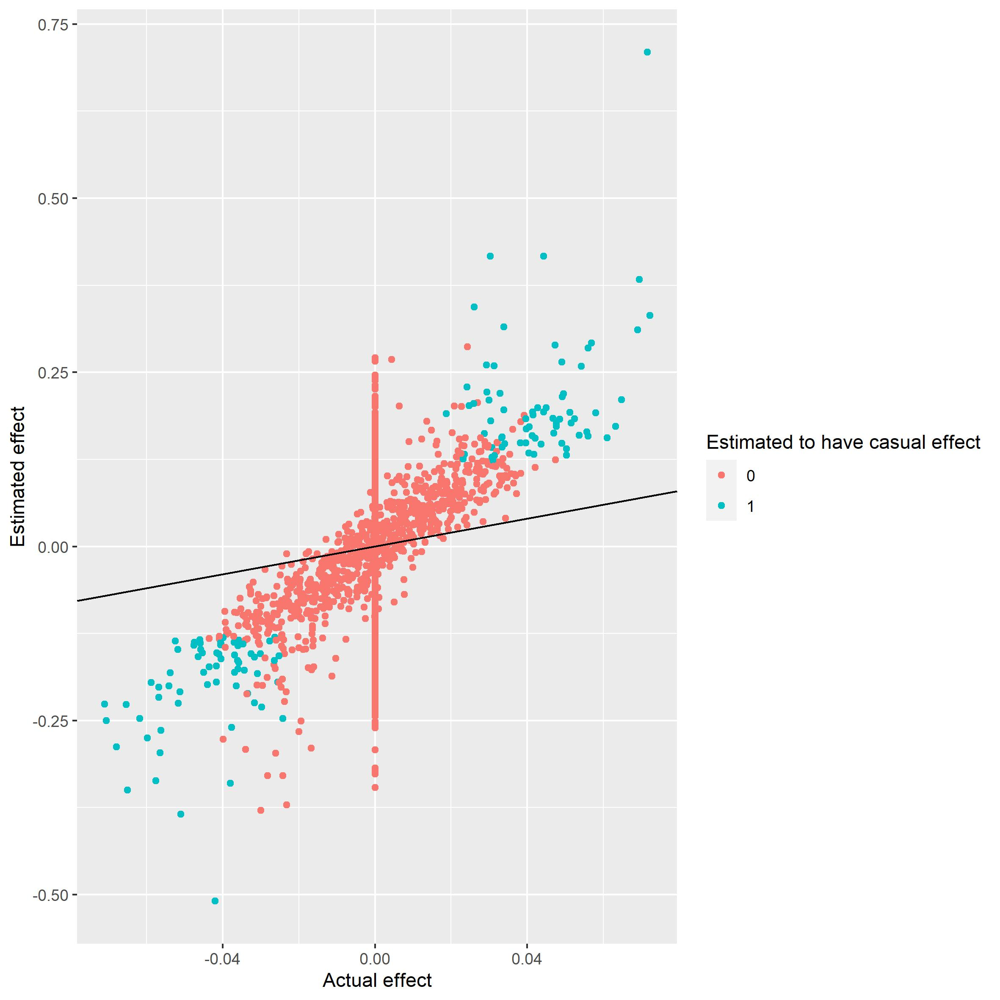

```{r, include = FALSE}
knitr::opts_chunk$set(
  collapse = TRUE,
  comment = "#>"
)
```

## Simple association analysis

Using the method of described in gen_sim to simulate genetic data, we can use that data to visualise both association studies and methods of prediction. In this artcle we are going to cover the use and theory of the method GWAS. GWAS, which stands for genome-wide association studies is a method used for, as the name implies, association studies. Meaning that based on large quantities of genetic data we would like to know which places on the genome is critical for developing the the given sickness or trait.  

GWAS is in simple terms a linear regression which for each SNP tries to estimate the casual effect of having a mutation on the probability of having the trait or sickenes. GWAS can therefore be written as the linear regression:

$$
Y \sim \mathcal{N}(X\beta,\Sigma)
$$
Where $Y$ denotes the actual traits of the subjects. $Y$ will be 1 if the subject has the sickness/trait and zero if not. X is the genetic data, if generated by the gen_sim() function, then this equal to G. 


## GWAS using logistic regression

By default the function GWAS() will use a linear regression. The concept of $Y$ as a binary variable open the door for other models. A simple one is the logistic regression which uses the logit function as its activation function to transform the linearregression into a probability curve. This model is also implemented in our GWAs function and can be accessed by setting 'logreg = TRUE'.

## Using GWAS

In the following tutorial a file is used which have been generated using the method described in gen_sim. First we load the data. We have here simulated $100,000\times100,000$ datapoints using 'fam=FALSE'. The family structure is unimportant since we are only using the trait of the subject.
```{r results='hide', warning=FALSE, message=FALSE}
library(genstats)
library(bigsnpr)
library(dplyr)
```

```{r warning = FALSE}
genetic_data = snp_attach('genetic_data.rds')
G=genetic_data$genotypes
y =  genetic_data$fam %>% select('pheno_0') 
beta = genetic_data$map$beta
```

Now we estimate the casual effect of each SNP

```{r warning = FALSE}
gwas_summary = GWAS(G=G, y=y[[1]], p=0.05/100000, logreg = FALSE, ncores=future::availableCores()%/%2)
knitr::kable(gwas_summary[1:10,], digits = 2, align = "c")
```

We are using bonferronni correction, and since we have $100,000$ indiviuals we will use $p=\frac{0.05}{100000}$.

## Perfomance

To illustrate the perfomance of GWAS 
The first plot shown below is a manhattan plot. The plot illustrates how well the analysis is to differentiate between casual and non causual snp. Two horisontal lines have been drawn illustrating the thresholds for the p-value.

```{r echo=T, results='hide', fig.show='hide'}
manhattan_plot(gwas_summary, beta, thresholds = c(5e-7, 0.05))
```

```{r, echo = FALSE}
knitr::include_graphics("gwas_manhattan.jpg")
```

This can also be illustrated using scatterplot. Here we see that we are good at finding estimates with very extreme effects, though it is much more difficult to for the association analysis around the middle. 

```{r echo=T, results='hide', fig.show='hide'}
scatter_plot(gwas_summary, beta)
```
```{r, echo = FALSE}
knitr::include_graphics("gwas_scatter.jpg")
```


We see that we catches the most extreme cases. Looking at a powerplot we see that we do not have the power to catch the less extreme cases.

```{r echo=T, results='hide', fig.show='hide'}
power_plot(gwas_summary, beta) 
```

```{r echo = FALSE}
knitr::include_graphics("gwas_power.jpg")
```


## Logistic regression
Since our target variable is binary it would seem reasonable to run logistic regression instead of linear.

```{r warning = FALSE, message=FALSE}
gwaslog_summary = GWAS(G=G, y=y[[1]], p=0.05/100000, logreg = TRUE, ncores=3)
knitr::kable(gwaslog_summary[1:10,], digits = 2, align = "c")
```


To check the perfomance we use the same method as above.
```{r echo=T, results='hide', fig.show='hide'}
manhattan_plot(gwaslog_summary, beta, thresholds = c(5e-7, 0.05))
```
```{r, echo = FALSE}

```

```{r echo=T, results='hide', fig.show='hide'}
scatter_plot(gwaslog_summary, beta)
```
```{r, echo = FALSE}

```

```{r echo=T, results='hide', fig.show='hide'}
power_plot(gwas_summary, beta)
```

```{r, echo = FALSE}
knitr::include_graphics("GWASlog_power.jpg")
```
According to the scatter plot it would seem logistic regression is better at estimating the effect size of each casual SNP, from the power plot however the logistic regression seem weaker. But both of these methods are outperformed by LT-FH(`vignette("LT-FH`).  

