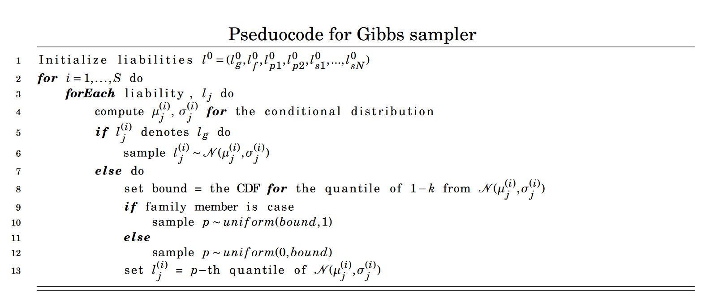

An assumption made by Hujoel et al.(2020) is that the liabilities of subjects and families follow a multivariate normal distribution (See vignette LTFH). With this assumption liabilities of each family member can be estimated if their phenotypes are provided. 

These liabilitites are estimated using Monte Carlo integration. In genstats a Gibb sampler has been implemented, by sampling from a conditional distribution for each liability estimates are obtained iteratively. The obtained phenotypes of family members can be implemented in the model by sampling from a truncated normal distribution.
To clarify if a family member is a case we know that the liability of the family member is above a threshold T, given a prevalence K. To sample from a a truncated normal distribution we sample a value from one of the two intervals shown below.
$$
T = \Phi^{-1}(1-K) \\
L_p \sim N(\mu_p, \sigma_p) \\
\Downarrow
\\
P(L_p \leq T) = F_{L_p}(T) \\
\Downarrow
\\
\text{if p is case}: p_{l_p} \in [F_{l_p}(T) , 1 ]\\
\text{else}: p_{l_p} \in [0, F_{l_p}(T)] \\
$$
Now we sample a value $p_{lp}$ uniformly from one of the two intervals given the family members case. To get a sample for $l_p$ we set $l_p = F_{L_p}^{-1}(p_{lp})$.
The pseudocode for the Gibbs Sampler is shown below


This code is within a while loop that break when standard error of the mean is under 0.1 to ensure convergence.
With this constraint, we've tried to ensure convergence, convergence can be shown with by plotting the values for each iteration.
For the plot below the configuration is (1,1,0,1,0), where 1 refers to CASE and 0 is control, and each number refers to the phenotype of a family member of the form $(phenotype_{subject}, phenotype_{parent1}, phenotype_{parent2}, phenotype_{sibling1}, ...,phenotype_{siblingN})$.
```{r}
ests = gibbs_sampl(covmat = get_cov(0.5, n_sib = 2), phenos = c(1,1,0,1,0), K = 0.05, start_run = 500, all_est = TRUE)
colnames(ests) = c("Genetic Liability subject",
                   "Liability subject, CASE",
                   "Liability parent1, CASE",
                   "Liability parent2, CONTROL",
                   "Liability sibling1, CASE",
                   "Liability sibling2, CONTROL")
# means <- as_tibble(ests) %>%
#           pivot_longer(cols = everything(), names_to = "pheno") %>%
#             group_by(pheno) %>%
#               summarise(MN = mean(value), MN_x = length(value)/2, .groups = "keep")
# 
# as_tibble(ests) %>%
#   mutate(iterations = (1:length(l_g_0))) %>%
#   pivot_longer(!iterations, names_to = "pheno") %>%
#   ggplot(aes(x = iterations, y = value)) + geom_line(aes(col = "brick")) + geom_hline(data = means, aes(yintercept = MN)) + facet_wrap(~pheno) + geom_label(data = means, aes(x = MN_x, label=round(MN,digits = 3), y=MN -0.1), size = 2.5, vjust = "top")
plot_gibbs(ests)
```
The plots shows that all the the liabilities are converged with a starting value of 0. And also it seems that the Gibbs sampler converges incredibly fast. The Gibbs sampler is therefore performing as we would expect.

The standard values for the genstats::gibbs_sampl is a starting value at 0 and a burn in of 500.


