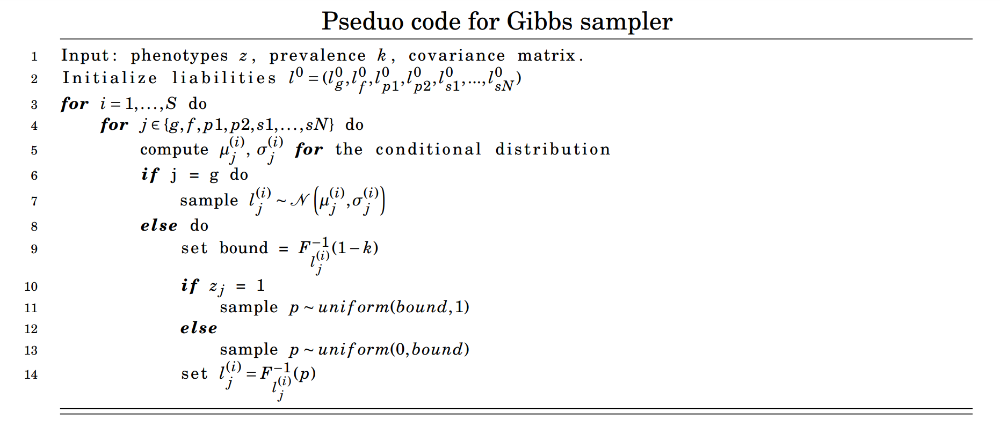

```{r, include = FALSE}
knitr::opts_chunk$set(
  collapse = TRUE,
  comment = "#>"
)
```


An assumption made by Hujoel et al.(2020) is that the liabilities of subjects and families follow a multivariate normal distribution. With this assumption liabilities of each family member can be estimated if their phenotypes are provided. 

These liabilities are estimated using Monte Carlo integration. In genstats a Gibbs sampler has been implemented, by sampling from a conditional distribution for each liability estimates are obtained iteratively. The obtained phenotypes of family members can be implemented in the model by sampling from a truncated normal distribution.
To clarify if a family member is a case we know that the liability of the family member is above a threshold T, given a prevalence K. We calculate the threshold given the standard normal distribution.

$$
T = \Phi^{-1}(1-K)
$$
The liability of person i is given by the conditional distribution.

$$
L_{p_i} \mid L_{p_1}, \ldots, L_{p_{i-1}}, L_{p_{i+1}}, \ldots,  L_{p_N} \sim N(\mu_p, \sigma_p)
$$
Using this we can sample from a truncated normal distribution. Given the distribution of $L_{p_i}$ we write the following intervals.
$$
P(L_{p_i} \leq T \mid L_{p_1}, \ldots, L_{p_{i-1}}, L_{p_{i+1}}, \ldots,  L_{p_N}) = F_{L_{p_i}}(T) \\
\Downarrow
\\
\text{if p is case}: p_{l_{p_i}} \in [F_{L_{p_i}}(T) , 1 ]\\
\text{else}: p_{l_{p_i}} \in [0,F_{L_{p_i}}(T)] \\
$$

Now we sample a value $p_{lp}$ uniformly from one of the two intervals given the family members case. To get a sample for $l_p$ we set $l_p = F_{L_p}^{-1}(p_{lp})$.

Using Monte Carlo integration we find the conditional distribution of each liability. Using the assumption at liabilities follow a normal distribution where $l_g\sim\mathcal{N}(0,h^2)$, $l_e\sim\mathcal{N}(0,1-h^2)$ and $l_{full} = l_g+l_e \sim\mathcal{N}(0,1)$ we can write the following mean and covariance matrix for the variables. We are here not using any siblings, but they can be added as wished.

$$
\mu =
\begin{pmatrix}
0 \\
0 \\
0 \\
0
\end{pmatrix}, \quad
\Sigma = 
\begin{pmatrix}
1-h^{2} & 0 & 0 & 0 \\
0 & h^{2} & \frac{h^{2}}{2} & \frac{h^{2}}{2} \\
0 & \frac{h^{2}}{2} & 1 & 0 \\
0 & \frac{h^{2}}{2} & 0 & 1
\end{pmatrix}
$$

Where

$$
\begin{pmatrix}
l_{c} \\
l_{g} \\
l_{p_{1}} \\
l_{p_{2}}
\end{pmatrix} \sim \mathcal{N}\left(\mu,\Sigma
\right)
$$

This we can transform into

$$
\overline{\mu} =
\begin{pmatrix}
0 \\
0 \\
0 \\
0
\end{pmatrix}, \quad
\overline{\Sigma} = 
\begin{pmatrix}
h^{2} & h^{2} & \frac{h^{2}}{2} & \frac{h^{2}}{2} \\
h^{2} & 1 & \frac{h^{2}}{2} & \frac{h^{2}}{2} \\
\frac{h^{2}}{2} & \frac{h^{2}}{2} & 1 & 0 \\
\frac{h^{2}}{2} & \frac{h^{2}}{2} & 0 & 1
\end{pmatrix}
$$
Where

$$
\begin{pmatrix}
l_{g} \\
l_{g}+l_e \\
l_{p_{1}} \\
l_{p_{2}}
\end{pmatrix} \sim \mathcal{N}\left(\overline{\mu},\overline{\Sigma}
\right)
$$
Using the multivariate normal the conditional distribution for each variable can easily be calculated. To illustrate that the simulated data has this distribution we will calculate the covariance matrix of non truncated data using a heritability of 0.5 and one sibling.

```{r}
library(genstats)

covariance = get_cov(0.5, n_sib = 1)
estimated = gibbs_sampl(covariance, phenos=c(1,0,1,0), K=FALSE, all_est = TRUE)
knitr::kable(cov(estimated), digits = 2, caption = "Covariance Matrix")
```


The pseudo code for the Gibbs Sampler is shown below


Where $F^{-1}_{l_j^{(i)}}(1-k)$ is the CDF of $\mathcal{N}\left(\mu_{j}^{(i)}, \sigma_{j}^{(i)}\right)$
This code is within a while loop that break when standard error of the mean is under 0.1 to ensure convergence.
With this constraint, we've tried to ensure convergence. Convergence can be shown by plotting the values for each iteration.
For the plot below the configuration is (1,1,0,1,0), where 1 refers to CASE and 0 is control, and each number refers to the phenotype of a family member of the following form.
$$
(z_{subject}, z_{parent1}, z_{parent2}, z_{sibling1}, ...,z_{siblingN})
$$
Where $z \in {0,1}$ denotes the phenotype

```{r}
ests = gibbs_sampl(covmat = get_cov(0.5, n_sib = 2), phenos = c(1,1,0,1,0), K = 0.05, start_run = 500, all_est = TRUE)
colnames(ests) = c("Genetic Liability subject",
                   "Liability subject, CASE",
                   "Liability parent1, CASE",
                   "Liability parent2, CONTROL",
                   "Liability sibling1, CASE",
                   "Liability sibling2, CONTROL")
plot_gibbs(ests)
```


The plots shows that all the the liabilities are converged with a starting value of 0. And also it seems that the Gibbs sampler converges incredibly fast. The Gibbs sampler is therefore performing as we would expect.

The standard values for the `?gibbs_sampl` is a starting value at 0 and a burn in of 500. The method is used in `?LT-FH`, see `vignette("LT-FH")` for further information.
