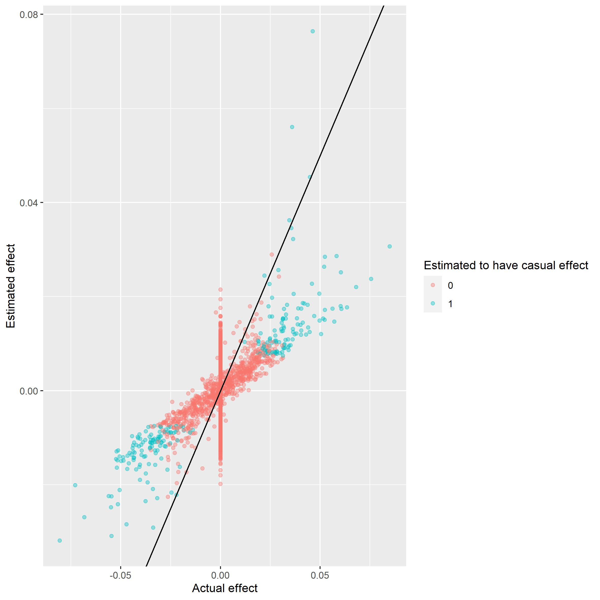

```{r, include = FALSE}
knitr::opts_chunk$set(
  collapse = TRUE,
  comment = "#>"
)
```


We use the following packages in this vignette.

```{r message=FALSE, warning=FALSE}
library(genstats)
library(bigsnpr)
library(tidyverse)
```


A more sofisticated method of analysing the genetic data and finding the causal SNP's is using LT-FH (liability threshold family history). This methods uses a gibbs sampler in order to estimate the genetic liability of each subject based on the family history, i.e. if the subject, it's parent or siblings have the given trait or sickness. Using this estimate an updated expected value for the genetic liability can be obtained.

LTFH is based on a sampling using Monte Carlo integration. More on the on this can be found in the vignette for gibb sampling.
Below is shown three plots with the estimated posterior mean genetic liabilities compared to the standard normal distribution of the genetic liability. The plots shows the outcome of running the gibbs samber for the configurations (0,0,0), (0,0,1) and (1,1,1) respectively.

```{r}
gridExtra::grid.arrange(control_plot(phenos = c(0,0,0), h2 = 0.5, col = "royalblue"),
                        control_plot(phenos = c(0,0,1), h2 = 0.5, col = "mediumorchid"),
                        control_plot(phenos = c(1,1,1), h2 = 0.5, col = "firebrick"), heights = 0.5, name = c("Plots for configuration (0,0,0), (0,0,1), (1,1,1)"))
```

Using the estimates of genetic liabilities can instead of the phenotypes af the target vector can very beneficial. We are going to run through and example of this in the next section.


## Using LTFH

In the following tutorial a file is used which have been generated using the method described in vignette("gen_sim"). First we load the data. We have here simulated $1e^3\times1e^3$ datapoints using two siblings. In the following 100 SNPs has a casual effect. This data is only used to show case the method and illustrate how the package can be used. If the methods should be used to actual statistical analysis we recomend simulating $1e^5\times1e^5$ datapoints with about 500-1000 casual SNPs. For practical reasons we have not been apple to show case the analysis. We have included pictures to illustrate the results on $1e^5\times1e^5$ data.

```{r}
# The rds file containing simulated data is loaded
genetic_data = snp_attach('genetic_data.rds')

# We save the genotypes and beta for later use
G = genetic_data$genotypes
beta = genetic_data$map$beta

```

We know run LT-FH and as we can see we get the estimates for each subjects genetic liabilities as a new column.

```{r}
LTFH_est = LTFH(data = genetic_data, n_sib = 2)
head(LTFH_est)
```

The estimated genetic liabilities can now be used as wanted. We are here using them as the target vector in a linear regression in order to estimate the causual effect of each SNP.

```{r}
LTFH_summary = GWAS(G = G, y = LTFH_est$l_g_0, p = 5e-5, logreg = FALSE, ncores = 3)
head(LTFH_summary)
```

In the above table we se the result of the association analysis, where we can se which SNP's is estimated as casual. We are here using bonferronni correction to lower the amont of false positive causal SNP. And since we have $1e^3$ indiviuals we will use $p=\frac{0.05}{1000}=5e^{-5}$. We can se the result of our


## Outcome for realistic data
We will below give the results of the association analysis on a data set with $1e^5\times1e^5$ datapoint. The process of getting these result is the same as shown above we have here of course used a p-value of $p=\frac{0.05}{100000}=5e^{-7}$. The first plot shown below is a manhattan plot. The plot illustrates how well the analysis is to differentiate between casual and non causual snp. Two horisontal lines have been drawn illustrating the tresholds for the p-value. We can se that choosing to use the conservative method of bonferronni correction we describe the data better. Comparing this to the result og GWAS without using estimated liabilities we se that LTFH clearly performs better.   


```{r eval=FALSE}
manhattan_plot(gwas_summary = LTFH_summary, beta = beta, treshold = c(5e-7, 0.05))
```

```{r, echo = FALSE}

```


This can also be illustrated using scatterplot. Here we see that we are very good at finding estimates af very extreme effects, though it is much more difficult to for the association analysis around the middle. Agian this method very much out performs normal vignette("GWAS"). 

```{r eval=FALSE}
scatter_plot(gwas_summary = LTFH_summary, beta = beta)
```

```{r, echo = FALSE}
  
```


At last we include a plower plot to show case why we are not able to estimate the smaller causal effects. We simply do not have the power in our test to do so! 

```{r eval=FALSE}
power_plot(gwas_summary = LTFH_summary, beta = beta)
```
