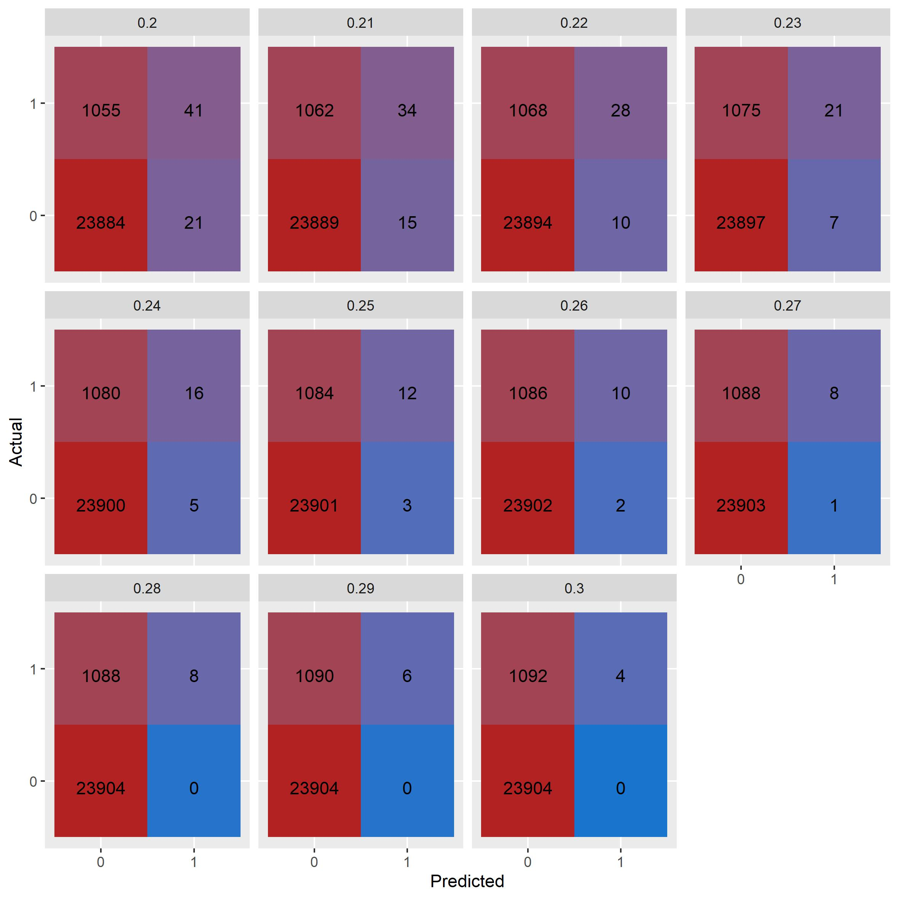
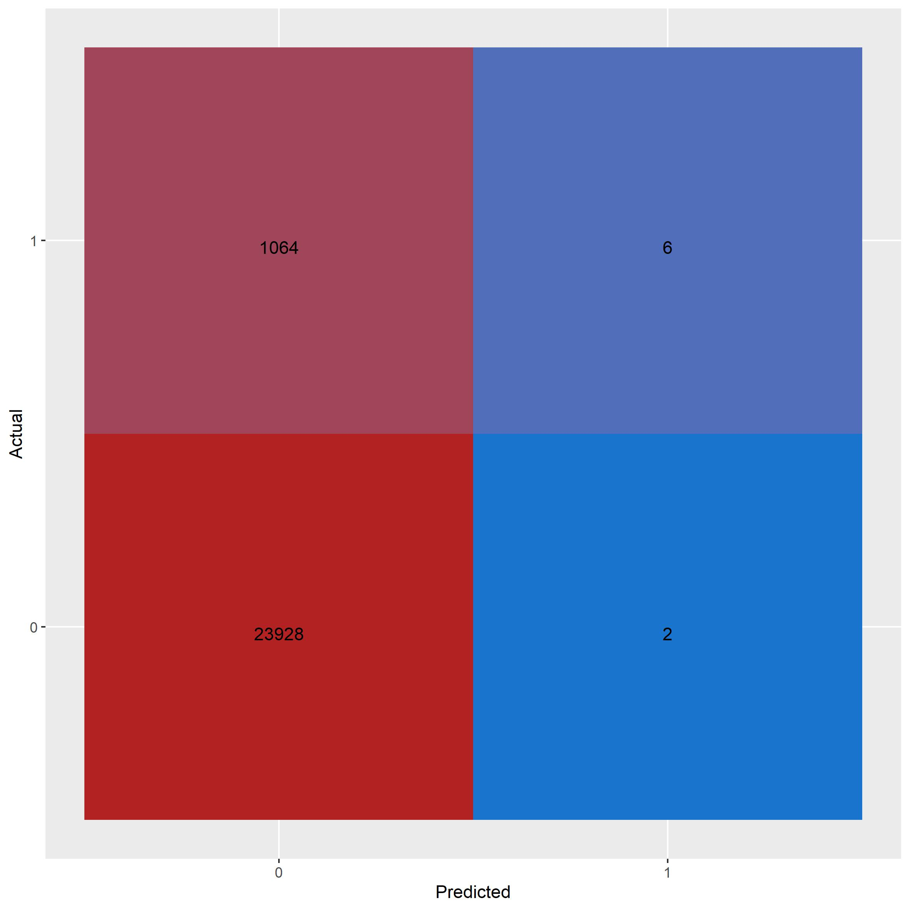
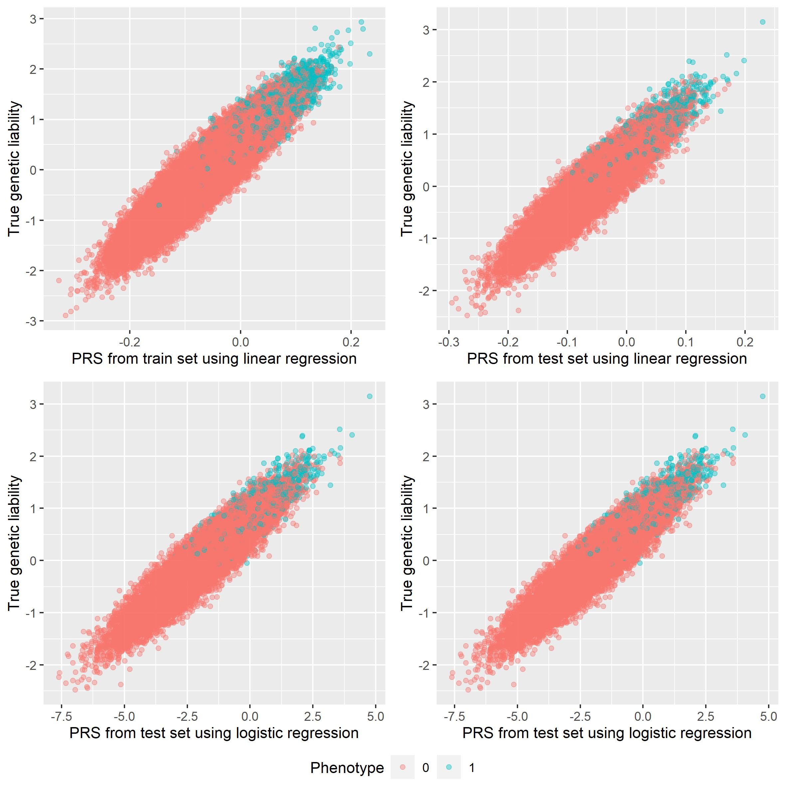

We are in this vignette showing the possibilities of using the result of association analysis in order to predict occurrence of the trait by looking at genetic data. In this analysis we are only looking at genetic data. In predicting the prevalence of trait/sickness many other factors will have to be taken into account. However it will be shown that it is possible to create a stronger model through the use of genetic data, if there of course is a high heritability. The method will be illustrated on $10^5\times10^3$ data with 500 casual SNPs with two siblings. This is not realistic, but it will show the potential of the method. Since $10^5\times10^3$ data is quite big the following code will be run on $10^4\times10^4$ data.

We use the following packages in this vignette.

```{r message=FALSE, warning=FALSE}
library(genstats)
library(bigsnpr)
library(tidyverse)
```


## Introduction to PRS

PRS, which stands for polygenic risk score, is a value, which can be used to indicate the genetic risk for a given sickness. PRS summarises the estimated effect of each SNP and is given by the following.

$$
PRS_i = \sum_{j=1}^{M}\hat{\beta_j} X_{ij}
$$
Where $X$ is the genotype matrix and $\hat{\beta_j}$ is the estimated effect of casual SNPs. However not every casual estimate might be relevant to consider, which gives place to the following modification.

$$
PRS_i = \sum_{j=1}^{M}X_{ij}\;\hat{\beta_j} D_j, \quad \text{where}\;\; D_j = \begin{cases} 1 \;\; \text{if}\;\;p_j>\mathcal{T}\\  0 \;\; \text{if}\;\; p_j\leq \mathcal{T}\end{cases}
$$
Where $\mathcal{T}$ is the threshold used for which the p-value has to be greater for the SNP to be estimated casual, this method is called thresholding.

In prediction we use a training set and a test set. We are in the following section going to show a method which uses LT-FH estimates as its target vectors. For more information about this association method see `vignette("LT-FH")`) .
```{r}
# Loading our train and test set
train_set = snp_attach("genetic_data.rds")
test_set = snp_attach("genetic_data_test.rds")

# We save the genotypes and target vector
G = train_set$genotypes
est <- LTFH(data = train_set, n_sib = 2) %>% select(., contains("est"))
y_ltfh = est[[1]]

```

Using PRS we want to find which threshold for the p-value describes the data best. We are therefore using cross validation. The following function outputs PRS estimates for the validation set for each fold in the training data.

```{r}
prs = PRS_cross(train_data = train_set, y = y_ltfh, cross_folds = 4)
```

We use these scores to evaluate the threshold. 

The following plot has been evaluated on $10^5\times10^3$ data.


```{r echo=T, results='hide', fig.show='hide'}
prs_auc = prs_plot(PRS = prs, train_set, 'AUC')
eval_prs_auc = gridExtra::grid.arrange(prs_auc$fold, prs_auc$mean, ncol=2)
```

```{r, echo = FALSE}

```


```{r echo=T, results='hide', fig.show='hide'}
prs_mse = prs_plot(PRS = prs, train_set, 'MSE')
gridExtra::grid.arrange(prs_mse$fold, prs_mse$mean, ncol=2)
```


```{r, echo = FALSE}

```


```{r echo=T, results='hide', fig.show='hide'}
prs_r2 = prs_plot(PRS = prs, train_set, 'R2')
gridExtra::grid.arrange(prs_r2$fold, prs_r2$mean, ncol=2)
```


```{r, echo = FALSE}
knitr::include_graphics("eval_prs_r2.jpg")
```


Looking at the above plot we find that the optimal threshold for the p-value is around 3.
Next we would like to know which decision boundary of PRS we could expect the best result from. We are not considering how many false negatives we experience. It is more important that the amount of false positives is very low. Like GWAS or LT-FH we would prefer a much more conservative prediction. We are using cross validation again with the following output for the $10^5\times10^3$ matrix.

```{r echo=T, results='hide', fig.show='hide'}
decision_cross(train_data = train_set, y = y_ltfh, cross_folds = 4, bounds=seq(0.2, 0.3, 0.01), thr = 3)
```


```{r, echo = FALSE}

```

We will choose a boundary around 0.25. We are now ready to create a prediction.


## Prediction using PRS
Using this we can create our model. We are only using a linear regression since we are using LT-FH estimates as our target vector.
```{r echo=T, results='hide', fig.show='hide'}
ltfh_model = pred_model(train_data = train_set, y = y_ltfh, thr = 3, LogReg = FALSE)
```

```{r, echo = FALSE}
knitr::include_graphics("prs_est_train.jpg")
```

And creating our predictions.

```{r echo=T, results='hide'}
pred = prediction(test_data = test_set, gwas = ltfh_model, thr = 3)
```

Now we use the value we found for the decision boundary and we have the following result.

```{r echo=T, results='hide', fig.show='hide'}
preds = (pred > 0.25)-0
confusion_matrix = as_tibble(table('Predicted' = preds[,1], 'Actual'= test_set$fam$pheno_0))

confusion_matrix %>% 
  ggplot(aes(x = Predicted, y = Actual)) +
  geom_tile(aes(fill = n), show.legend = FALSE) +
  geom_text(aes(label = sprintf("%1.0f", n)), vjust = 1) +
  scale_fill_gradient(high = "firebrick", low = 'dodgerblue3', trans='pseudo_log')
```

```{r, echo = FALSE}

```


However this is a suboptimal way of using PRS. Only using PRS to predict phenotypes is risky and in our case of the 1072 cases only 6 is correctly identified and 2 of the controls are predicted as cases. So $\frac{1}{4}$ of the case predictions are wrong. In the next section we will discuss a better use for PRS. 

## Documentation

We will in this section explain the process behind the above result. We can only expect to be able to predict the genetic liability. If a subject has a very low genetic liability, but high environmental liability we can of course not catch this with PRS. We are therefore going to plot the PRS against the genetic liability.

```{r, echo = FALSE}
knitr::include_graphics("prs_true_train.jpg")
```

We can see from the above plot that these values are strongly correlated. We can also plot the PRS of the test set.

```{r, echo = FALSE}
knitr::include_graphics("prs_true_test.jpg")
```

As expected boundary between cases and non cases is a bit less clear, but there is still a very high correlation.

It is therefore reasonable to add PRS as a controlling variable when performing prediction studies, this could be with other variables such as age, sex, BMI etc.

## Using phenotypes instead of LT-FH estimates

In the above LT-FH estimates have been in our prediction. We have done this as we believe this is a superior method with higher power and more accuracy. One argument for this is that we through PRS cannot expect to predict the cases, but we can predict who has a high genetic liability.


Using the same method as above we can see that the correlation between the genetic liability and PRS found with linear regression or logistic regression using phenotypes is much lower. For more information about the association analysis with phenotypes see `vignette("GWAS")`.


```{r, echo = FALSE}

```


